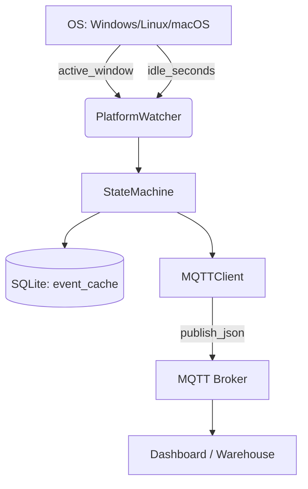

# ARCHITECTURE

computeruse-watcher es un agente ligero de telemetría cross-platform escrito en Python que reporta uso de computadora a un broker MQTT, con almacenamiento local SQLite para resiliencia.

---

## Diagrama de alto nivel

---

## Componentes

| Capa | Responsabilidad | Tecnología | OS soportado |
|------|----------------|------------|--------------|
| **PlatformWatcher** | Detectar ventana activa, idle, usuario, hostname | ctypes (Win), python-xlib (Linux), AppKit (macOS opcional) | Win/Linux/macOS |
| **StateMachine** | Máquina de estados: focus change, idle, sync SQLite→MQTT | Python asyncio-free, polling ligero | Todos |
| **DB** | Persistencia local WAL, cola de eventos pendientes | SQLite 3 | Todos |
| **MQTTClient** | Publicar eventos con QoS 1, LWT, reconnect | paho-mqtt | Todos |
| **CLI** | Entrypoint: `cuw run`, `--dry-run`, manejo de señales | argparse | Todos |

---

## Flujo de eventos

1. **Boot/Startup**
   - `StateMachine.start()` → publica `{status: online}` con retained=True
   - Evento `system` escrito a SQLite

2. **Login/Logout**
   - Detectado por `PlatformWatcher.username` (getpass)
   - Evento `session` (login/logout) escrito a SQLite y publicado

3. **Focus change**
   - `PlatformWatcher.active_window()` devuelve `(process_name, window_title)`
   - Si cambia, emite evento `focus_change` con `duration_seconds`
   - Si el mismo título persiste, no se emite repetido

4. **Idle detection**
   - `PlatformWatcher.idle_seconds()`
   - Si cruza `idle_threshold_sec`, emite evento `idle` una sola vez por sesión

5. **Resiliencia**
   - Cada evento primero a SQLite (`sent_status=0`)
   - En `_sync_pending()`, intenta publicar hasta éxito
   - Si broker cae, eventos se acumulan y se sincronizan al reconectar

---

## Configuración

- **YAML/ENV**: `poll_interval_sec`, `idle_threshold_sec`, `mqtt_topic_prefix`, `data_dir`, broker credentials
- **Variables de entorno**: `CUW_BROKER`, `CUW_PORT`, `CUW_USERNAME`, `CUW_PASSWORD`, `CUW_DATA_DIR`

---

## Métricas de performance

- **CPU**: < 1% promedio en polling 2s
- **RAM**: < 75 MB en Python 3.14 + pytest + tooling (Windows)
- **Almacenamiento**: SQLite WAL, ~1KB/evento

---

## Seguridad

- **Sin TLS en v1**: solo red local/VPN confiable
- **Títulos de ventana**: reportados completos; filtrado en servidor
- **Sin ejecución remota**: solo telemetría unidireccional
- **Caché local**: SQLite cifrado opcional en fases futuras

---

## Roadmap

- v1: Windows/Linux/macOS (finalizado)
- v2: Android (foreground app + boot, sin window titles)
- v3: TLS + autenticación mutua
- v4: Cifrado local SQLite
- v5: Plugins de integración (Prometheus, Grafana, BigQuery)
